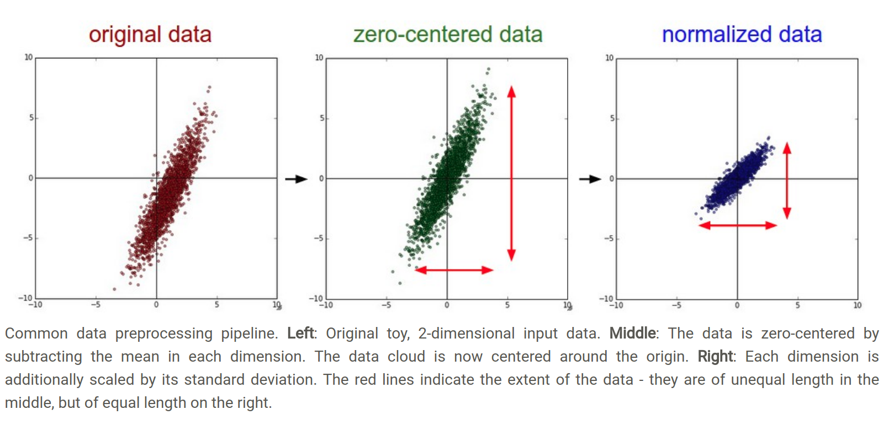

[Reference](http://cs231n.github.io/neural-networks-2/#intro)
## Data Preprocessing

### Mean subtraction

It involves subtracting the mean across every individual feature in the data,
and has the geometric interpretation(几何解释) of centering the cloud of data
around the origin alone every dimension.(`X = X - np.mean(X, axis = 0)`)


With images specifically, for convenience it can be common to substract a single
value from all pixels (e.g. `X -= np.mean(X)`), or to do so separately across
the three color channels.

### Normalization

Normalization refer to normalizing the data dimensions so that they are of
approximately the same scale.

Two common ways:

1. One is to divide each dimension by its standard deviation, once it has been
zero-centered:(`X /= np.std(X, axis = 0)`).

2. Another form of this preprocessing normalizes each dimension so that the min
and max along the dimensions is -1 and 1 respectively.

In case of images, the relative scales of pixels are already approximately equal
(and in range from 0 to 255), so it is not strictly necessary to perform this
additional preprocessing step.



### PCA and Whitening

This is another form of preprocessing. In this process, the data is first
centered as description above. Then we compute the covariance(协方差) matrix
that tells us about the correlation structure in the data.

```
# Assume input data matrix X of size [N x D], where N is the number of data and D is their dimensionality.

X -= np.mean(X, axis = 0) # zero-center the data (important)
cov = np.dot(X.T, X) / X.shape[0] # get the data covariance matrix
```
The (i, j) element of the data covariance matrix contains the covariance between i-th and j-th dimension of the data.

## 未完待续...
