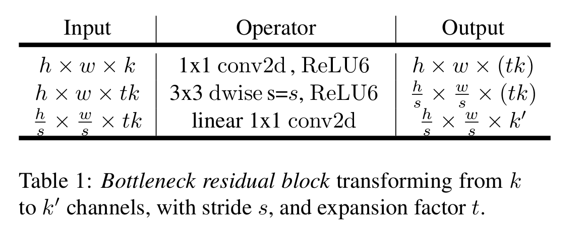
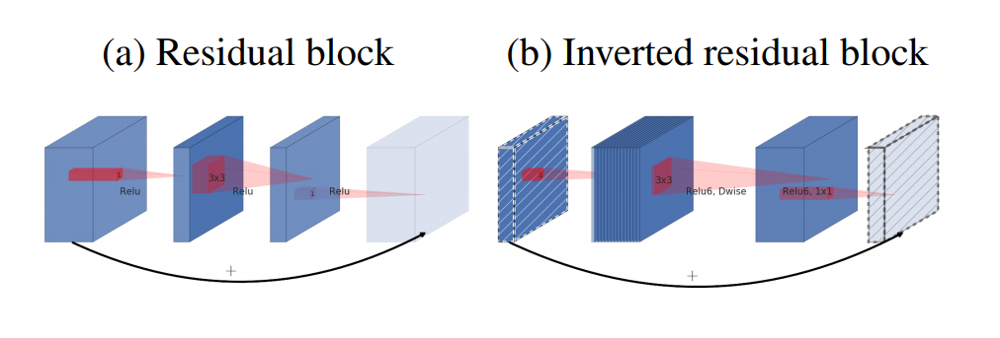
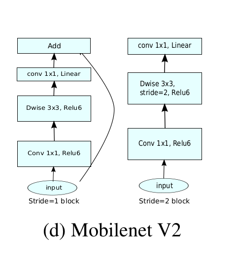
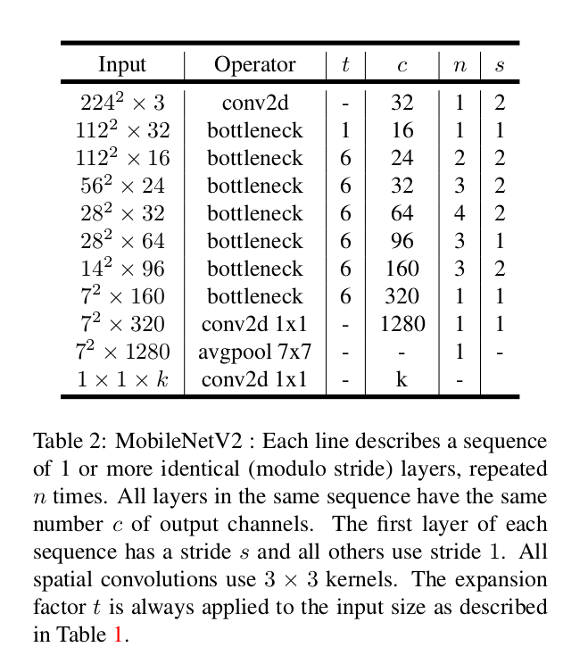

> 论文[链接](https://arxiv.org/pdf/1801.04381.pdf)

## 论文核心：

- Inverted residual structure
  1. 1x1 conv2d, relu6. 增加通道数: (h, w, k) --> (h, w, tk)

  2. 3x3 dwise_conv, relu6. depth-wise convolution: (h, w, tk) --> (h/s, w/s, (tk))
  3. linear 1x1 conv2d. point-wise convolution后没有非线性激活函数：(h/s, w/s, (tk)) --> ()  (h/s, w/s, (k'))

$\Gamma(n) = (n-1)!\quad\forall n\in\mathbb N$
