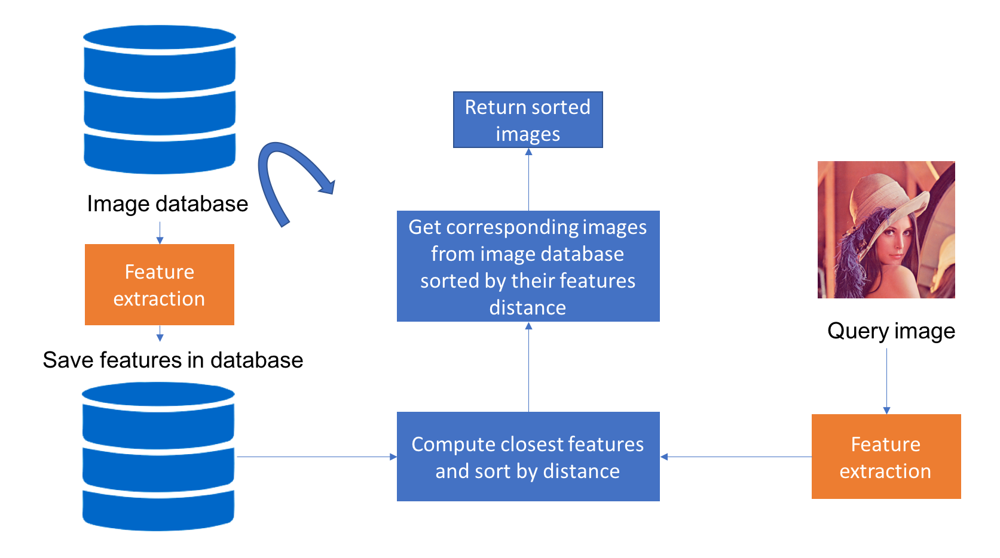

[Content based image retrieval using a convolutional denoising autoencoder](https://blog.sicara.com/keras-tutorial-content-based-image-retrieval-convolutional-denoising-autoencoder-dc91450cc511)

## Content based image retrieval(CBIR)
给定一张查询图片，从图像索引库中检索出与查询图片相似的图片。

CBIR系统中索引库中保存的是图片的视觉内容，比如颜色、纹理、形状等。

首先对图像数据集中的每张图片分别提取特征并保存，新来一张查询图片时，对其提取特征并与索引库中的特征进行比对，返回最相似的特征所对应的图片。

### 特征提取
CBIR系统中最核心的内容便是特征提取，提取的特征必须支持高效的检索，因而特征维度不能太大（一般索引库很大）。

hand crafted features:
- histogram of colours 表示颜色
- historgram of oriented gradients 表示形状
- SIFT or SURF被证明在图像检索应用中很稳定。

Deep learning:
- CNN训练分类器，然后用全连接层的输出作为特征
image1 -> CNN -> feature1 -> dimension-reduction + L2-normalized -> feature1  
image2 -> CNN -> feature2 -> dimension-reduction + L2-normalized -> feature2

feature1, feature2 -> L2-distance
