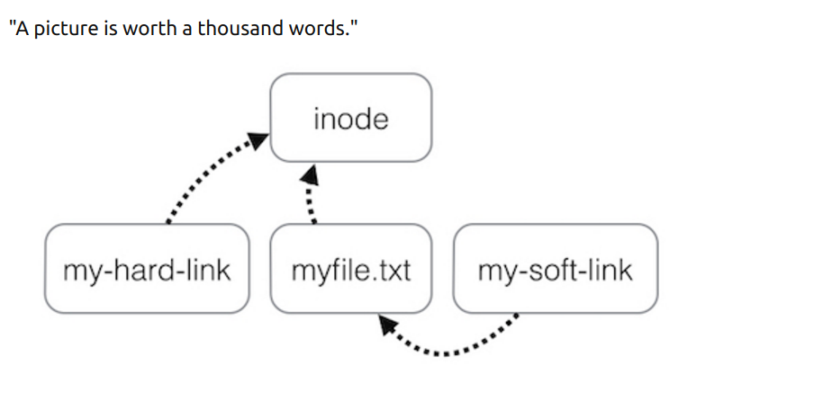

## 一、安装软件

* .deb
  * 安装软件：sudo dpkg -i ****.deb
  * 卸载软件：sudo dpkg -r ****.deb
  * 完全卸载软件：sudo dpkg -P ****.deb
* apt
  * 安装：sudo apt install <package_name>
  * 卸载：sudo apt --purge remove <package_name>

## 二、硬链接和软链接（符号链接）的区别



１. 硬链接 (hard link)

    ln file1 file1_hardlink

给file1创建了一个硬链接fiel1_hardlink，２个文件的内容是关联的，修改其中任何一个文件的内容，另一个文件也会跟着被修改，２个文件的大小一样。但是删除某一个文件并不会影响另一个文件。

２. 软链接（soft link）

    ln -s file2 file2_softlink

同样２个文件是关联的，与硬链接不同的是，软链接文件的大小为0，删除或移动原文件会影响软链接文件。

硬链接只能在同一个文件系统中创建，而软链接可以跨文件系统创建。

３. 此处只做了简单区分，[参考自这里](https://askubuntu.com/questions/108771/what-is-the-difference-between-a-hard-link-and-a-symbolic-link)。

## 三、设置程序开机自启

方法有很多，这里只记录其中一种：

    1. sudo vim /etc/rc.local
    2. 在exit 0之前添加想在开机时运行的命令
    3. 如果想以指定用户运行某个命令: sudo -u username <cmd>

## 四、终端使用socks5代理

### 配置：

1. sudo apt install polipo
2. sudo vim /etc/polipo/config
3. config内容设置如下：
```
    logSyslog = true
    logFile = /var/log/polipo/polipo.log
    socksParentProxy = "localhost:1080"
    socksProxyType = socks5
    logLevel=4
```
4. 关闭软件，让设置生效: sudo service polipo stop
5. sudo service polipo start

### 使用：

1. vim ~/.bashrc
2. 最后一行写入：
```
    alias ss="https_proxy=http://localhost:8123"
    或者http代理:
    alias ss="http_proxy=http://localhost:8123"
```
alias命令是设置别名用的，这里ss就代表"http_proxy=http://localhost:8123".
3. 以代理方式运行某条命令，只需在其前面加上ss就可以了。
```
    例如：ss curl ip.gs　(显示当前ip的详细信息。)
```

### git需要重新配置代理

1. socks5代理：
```
    git config --global http.proxy 'socks5://127.0.0.1:1080'
    git config --global https.proxy 'socks5://127.0.0.1:1080'
```
2. http代理：
```
    git config --global http.proxy https://127.0.0.1:1080
    git config --global https.proxy https://127.0.0.1:1080
```
3. 取消：
```
    git config --global --unset http.proxy
    git config --global --unset https.proxy
```
### pip配置代理

1. vim ~/.bashrc
2. 最后一行加上：
```
    alias pip="pip --proxy 127.0.0.1:8123"
```
3. source ~/.bashrc

## 五、ubuntu和windows共享文件系统（永久）

1. sudo fdisk -l 查看想要挂载的分区的设备号，如/dev/sdb1
2. sudo vim /etc/fstab 在最后一行添加自己想要挂载的设备号，如：
```
    /dev/sdb1       /home/zj/dataShare      ntfs    defaults        0       0
```    
3. 保存重启。注意，挂载点不能为用户根目录，否则后果很严重。　　

## 六、修改双系统下默认启动系统

1. ubuntu下：
```
    sudo vim /etc/default/grub
    sudo update-grub
```
2. GRUB_DEFAULT=0表示默认启动第一个。
3. GRUB_TIMEOUT=3表示等待３s后启动。

## 七、权限管理

1. 修改文件权限：
  ```
  chmod 754 myfile
  ```
  上式表示修改文件myfile的权限为：user（文件所有者）只可以rwx(读，写和执行)，同group只可以rx（读和执行），other只可以r（读）。
* r=4, w=2, x=1 分别对应read,　write，xecute
* 7=4+2+1, 5=4+0+1, 4=4+0+0
* 三个数字分别对应user（文件所有者）, group, other　　　

2. 另一种方式是：
  ```
  chmod [ugoa] [+-=] [rwx] myfile2
  ```
  - 如给文件myfile2的所有者（即user）增加可执行权限：
    ```
    chmod u+x myfile2
    ```

    * u: user
    * g: group
    * o: other
    * a: all
    * +: 增加权限
    * -: 减少权限
    * =: 重置权限
    * r: read
    * w: write
    * x: xecute

## 八、ubuntu16.04外接显示器克隆显示

- Win + P 切换，我的机器只能在“只显示主屏幕，只显示扩展屏幕，扩展显示外接屏幕”
- 外接屏幕克隆显示
  1. 设置外接显示器的分辨率，使其与主显示器的分辨率相同，（如果２个显示器的分辨率差距过大，克隆显示的体验会很差）
  2. xrandr --- 查看当前连接的显示器
  3. xrandr --output LVDS-0 --same-as HDMI-0 --auto --- 克隆显示，自己根据主显示器设置参数。

## 九、解压缩
解压：
1. tar.gz 解压：'tar -zxvf file.tar.gz'
2. tar.bz2 解压：'tar -jxvf file.tar.bz2'
3. unzip file.zip

压缩：
1. tar -cvf file.tar file （仅打包）
2. tar -zcvf file.tar.gz file (打包并压缩)
3. zip -r file.zip file

### 7z
```
    sudo apt install 7zip-full
    7z x file.7z (解压到当前目录)
    7z x fiel.7z -r -onew_dir  (解压到指定目录，-r表示递归所有的子目录， -o指定解压到的目录，后面没有空格)
    7z a -t7z compress_name.7z dirname/* (压缩指定目录下的文件， a表示添加文件或目录到压缩包，-t指定压缩类型，一般为7z，-r表示递归所有子目录)
```

### pigz
并行压缩工具，参考自[简书文章](https://www.jianshu.com/p/4e69716804a5)，[pigz官方文档](http://zlib.net/pigz/pigz.pdf)
```
压缩：tar --use-compress-program=pigz -cpvf packages.tgz packages

解压： tar --use-compress-program=pigz -xvf packages.tgz
```
其中packages是要压缩的目录，packages.tgz是压缩后的名称。


## 十、 查看目录下文件个数
统计某文件夹下文件的个数：
`ls -l |grep "^-"|wc -l`

统计某文件夹下目录的个数：
`ls -l |grep "^ｄ"|wc -l`

统计文件夹下文件的个数，包括子文件夹里的：
`ls -lR|grep "^-"|wc -l`

如统计/home/han目录(包含子目录)下的所有js文件则：
`ls -lR /home/han|grep js|wc -l 或 ls -l "/home/han"|grep "js"|wc -l`

统计文件夹下目录的个数，包括子文件夹里的：
`ls -lR|grep "^d"|wc -l`

## 十一、 守护进程
- nohup cmd &
- 让正在运行的前台任务变为后台任务：先按`ctrl + z`暂停程序，然后执行`bg`命令（让最近一个暂停的“后台任务”继续执行。）更保险一点是再运行`disown`。

通过"后台任务"启动"守护进程"并不保险，因为有的系统的huponexit参数可能是打开的（on）。执行`shopt | grep huponexit`可查看huponexit参数的值。

- 让正在运行的程序后端运行，并设置退出终端不影响该程序的运行

`Ctrl + z` 暂停程序， 然后 `bg %1`, 然后`disown -h %1`。

## 十二、 Screen
参考自[这里](https://www.cnblogs.com/mchina/archive/2013/01/30/2880680.html)

GNU Screen是一款由GNU计划开发的用于命令行终端切换的自由软件。用户可以通过该软件同时连接多个
本地或远程的命令行会话，并在其间自由切换。 Screen可以看做是窗口管理器的命令行界面版本。

- 会话恢复
只要Screen本身还在运行，在其内部运行的会话都可以被恢复。

- 多窗口
在Screen环境下，所有的会话都独立运行，并拥有各自的编号、输入、输出和窗口缓存。

- 会话共享
Screen可以让一个或多个用户从不同终端多次登录同一个会话，并共享会话的所有特性（比如可以看到完全相同的输出）。它同时提供了窗口访问权限的控制，可以对窗口进行密码保护。

### Screen安装与简单使用
- 安装：`sudo apt install screen`
- 创建新窗口，并为新窗口取名：`screen -S somename`
- 创建新窗口，并执行某些操作：`screen vim text.txt`
screen创建了一个执行vim操作的单窗口会话，退出vim将退出该窗口会话。

- 查看窗口和窗口名称：
打开多个窗口后，可以使用快捷键`Ctrl + a + w`列出当前所有窗口。

- 会话分离与恢复
可以在不中断screen窗口中程序的运行而暂时断开（detach）screen会话，并在随后时间重新连接(attach)该会话，重新控制各窗口中运行的程序。
 - 会话分离：`Ctrl a + d`
 - 会话恢复：`screen -ls`查看窗口编号，然后`screen -r 编号`恢复该会话。

如果在另一台机器上没有分离一个Screen会话，此时`screen -r 编号`不会发生作用，会输出"There is no screen to be resumed matching 编号"，此时可以使用下面命令强制将这个会话从它所在的终端分离，转移到新的终端上来。`screen -d`，然后再`screen -r 编号`。


## 十三、设置ssh免密登录ubuntu服务器

机器A 登录 机器B

1. 机器A生成秘钥：`ssh-keygen -t rsa`
2. 将生成的公钥复制到机器B个人目录下的.ssh目录中：`scp rsa.pub username@ip:/home/yourpersonaldir/.ssh/`
3. 将机器B上的公钥中的内容添加到~/.ssh目录下的authorized_keys文件中：`cat ~/.ssh/rsa.pub >> ~/.ssh/authorized_keys`
4. 机器A终端输入：`ssh username@ip`
6. 可在本地.ssh目录下新建config文件，为用户名和ip地址添加别名:
```
Host  简称
hostname 机器域名或ip
user 用户名
```
7. 大功告成！

## 十四、ubuntu挂载远程目录到本地

[参考自这里](https://xumi1993.github.io/blog/2019/03/%E7%94%A8sshfs%E8%BF%9C%E7%A8%8B%E6%8C%82%E8%BD%BD%E8%B7%AF%E5%BE%84%E5%88%B0%E6%9C%AC%E5%9C%B0/)

### 临时挂载
1. 需要在机器1上访问机器2上的文件目录
2. 机器1安装'sshfs': `sudo apt install sshfs`
3. 机器1上新建映射目录（用来映射到机器2上的目录）：`mkdir local_data_map`
4. 将机器2上的'remote_data_share'挂载到机器1上的'local_data_map'，机器1终端运行：`sshfs username2@server2:remote_data_share local_data_map`
5. 卸载，机器1终端运行：`sudo umount local_data_map`

### 永久挂载
1. `sudo vim /etc/fstab`，添加如下内容：
```
sudo sshfs -o allow_other -o reconnect -o transform_symlinks -o follow_symlinks -o cache=yes remote_user@server:/path/to/mount /mnt/xxx

```
- allow_other 允许userid与服务器上userid不同的用户访问（非常重要）
- reconnect 断线重联
- transform_symlinks 表示转换绝对链接符号为相对链接符号
- follow_symlinks 沿用服务器上的链接符号
2. sudo mount -a

## 未完待续
