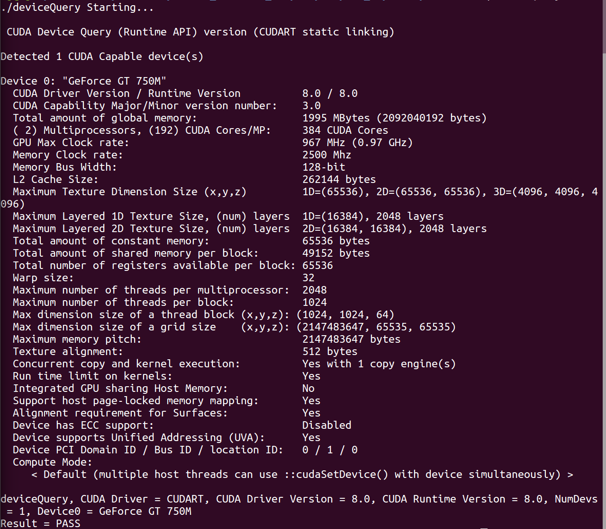

# ubuntu16.04安装gpu版tensorflow＋keras

## 一 安装cuda

１. [下载cuda](https://developer.nvidia.com/cuda-downloads),我选择的是.deb(local)版本的，下载万之后安装

	1. sudo dpkg -i cuda-repo-ubuntu1604-8-0-local-ga2_8.0.61-1_amd64.deb
	2. sudo apt-get update
	3. sudo apt-get install cuda
	4. vim ~/.bashrc
	5. 最后一行写上：export PATH=/usr/local/cuda-8.0/bin${PATH:+:${PATH}}

２. 验证 nvcc -V　显示编译器信息，则说明cuda配置成功了

３. cuda性能测试

	1. 安装可写样本：cuda-install-samples-8.0.sh <dir>
	2. cd NVIDIA_CUDA-8.0_Samples
	3. make
	4. cd NVIDIA_CUDA-8.0_Samples/bin/x86_64/linux/release
	5. ./deviceQuery
	6. 输出如图：结果显示pass则说明cuda安装配置完成。

４. 安装cudnn库

	１. 下载cudnn v5.1
	2. 解压，然后把解压后的文件夹cuda下的include和lib64文件夹下的文件复制到/usr/local/cuda/下对应的include和lib64文件夹里。
		sudo cp include/cudnn.h /usr/local/cuda/include/
		sudo cp lib64/* /usr/local/cuda/lib64/
	３. cd /usr/local/cuda/lib64
	4. sudo ln -sf libcudnn.so.5.1.10 libcudnn.so.5
	5. sudo ln -sf libcudnn.so.5 libcudnn.so
	6. sudo ldconfig -v

## 二　运算加速库

	sudo apt install -y libopenblas-dev liblapack-dev libatlas-base-dev
	sudo apt-get install libcupti-dev

## 三　安装gpu版[tensorflow][]

  [tensorflow]: https://www.tensorflow.org/install/install_linux#InstallingAnaconda
