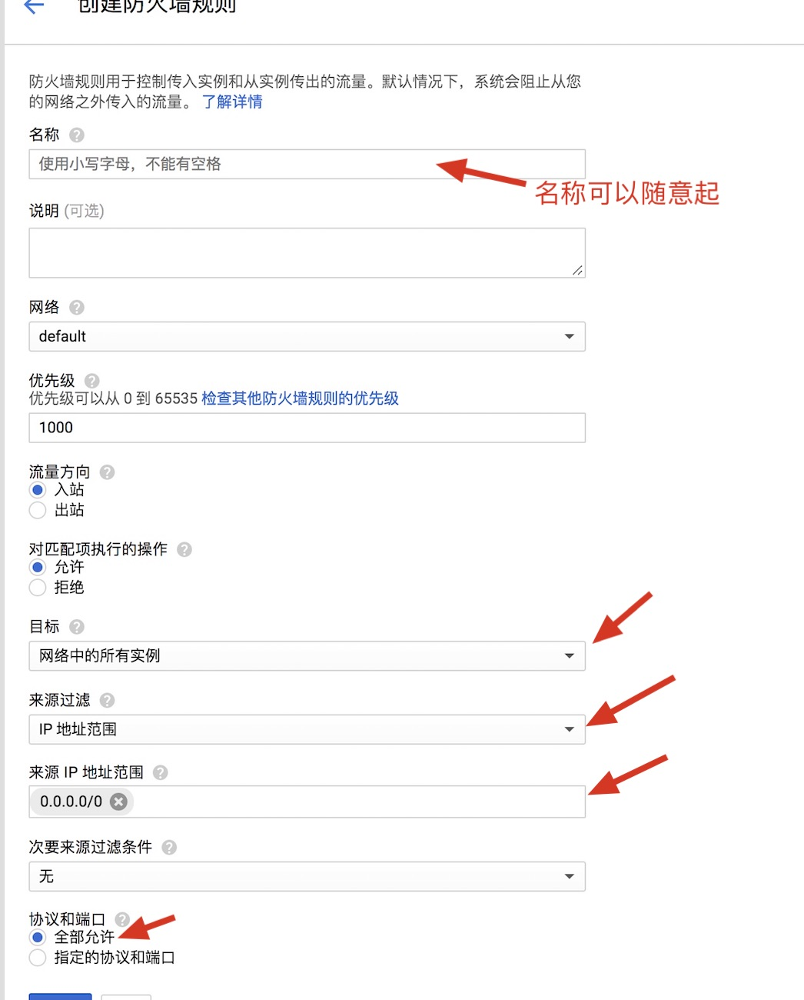

## 本页内容禁止转载。
```
1. git clone -b master https://github.com/flyzy2005/ss-fly

2. ss-fly/ss-fly.sh -i your_passwd your_server_port

启动：/etc/init.d/ss-fly start
停止：/etc/init.d/ss-fly stop
重启：/etc/init.d/ss-fly restart
状态：/etc/init.d/ss-fly status
查看ss链接：ss-fly/ss-fly.sh -sslink
修改配置文件：vim /etc/shadowsocks.json

ss-fly/ss-fly.sh -uninstall

3. ss-fly/ss-fly.sh -bbr
判断bbr有没有开启：
sysctl net.ipv4.tcp_available_congestion_control
返回net.ipv4.tcp_available_congestion_control = bbr cubic reno则说明已开启成功。

```


## 修改防火墙

参考自[这里](http://sstlant.com/2018/02/25/%E4%BD%BF%E7%94%A8%20Google%20Cloud%20%E6%90%AD%E5%BB%BA%E4%B8%80%E5%B9%B4%E5%85%8D%E8%B4%B9%20Shadowsocks%20%E6%95%99%E7%A8%8B/)

Google Cloud 依次选择【VPC网络】--> 【防火墙规则】--> 【创建防火墙规则】，修改下图红色箭头部分内容。



## 必须设置静态ip